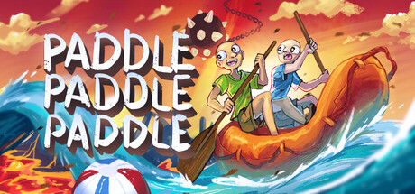

[2025-12-11]{.label .label-primary} [Stats]{.label .label-default} • by [\_michdev](https://michdev.nekoweb.org/)

------------------------------------------------------------------------

```{r include=FALSE}
source("./r_scripts/base.r")
```

::: {.alert .alert-dismissible .alert-warning}
<button type="button" class="close" data-dismiss="alert">

×

</button>

<h4>Warning!</h4>

<p>Graphs may take a couple seconds to load, if you see any large blank spaces it's likely still loading them.</p>
:::

## Intro {#sec-intro}

------------------------------------------------------------------------

When it comes to putting your game out there, genre matters alot more than you'd think. Each genre resides in a corner of Steam, an ever expanding catalog of games by small indies and giants alike, and it's important to learn the culture and standards of that corner. Lately, multiplayer games have been on the rise with recent works like Lethal Company, Bopl Battle, Peak, and R.E.P.O. as examples. As I develop a prototype for my own commercial PvP (Player v.s. Player) game, it's becoming more important to understand the community behind it; to see gaps in the genre, find examples of games that have succeeded and failed in different earning brackets and why, and how they're priced.

I'm using a database built by scraping \~140,000 released games off of Steam, collecting info like their tags, prices, review scores, and all other data Steam makes public. This data is from Q4 2024, approximately a year ago, so some data may have changed with the spike of the "friendslop" genre, a multiplayer-focused genre built around quick games you can jump into with a small group of friends, rather than bigger long-term journeys. I hypothesize that my game will fit into the space of games like Landfall's, makers of games like stick fight and ROUNDS, while having some sports and hot-potato elements present in party games like Mario Party, but more honed in to a specific idea rather than being a series of mini-games.

## Tags {#sec-tags}

------------------------------------------------------------------------

Tags are a big part of how Steam shares your game. It uses them to recommend your game alongside games with similar tags, as well as showing the game more to people who have played games with similar tags once you hit the Discovery Queue, a one-time opportunity every released game gets to be displayed to Steam users to test their viability. Because of this, it's important to hit the right tags, and they're really useful to analyze how different kinds of games, aswell as specific features in games, tend to perform. Among the games on the database, these are the tags used, scaled by how common they are: 

We can infer some genres which may be over saturated like Casual, Adventure, and Action, but it'd be hard to say without data on review counts and whether or not indies are regularly finding break-throughs in the genre. The giant and clear outlier is single-player, even though not all single player games necessarily have the tag selected, you can see the stark difference between it and multiplayer at the top right corner. This is likely because online networking is a complicated process that most indies can't break into, but a benefit of the recent focus on party games and co-op is that you don't need any servers to connect different players with; these kinds of games are small enough that players can directly connect to each other in a system called Peer to Peer (P2P) instead of Peer to Server, and steam's servers for lobbies can complete the rest for joining a public lobby. This is more accessible than it used to be, and at no extra cost for anyone putting their game on Steam.


## Multiplayer Versus Single-player {#sec-multiplayer-versus-single-player}

------------------------------------------------------------------------

We've also seen a rise in smaller, at times more janky games, such as Lethal Company which leans into it to add onto the fun of collecting scrap with friends, but that doesn't mean you can get away with a bad product, and the market tends to be harsher for multiplayer games which we can see by comparing the review scores of single player versus multiplayer games.

```{r echo=FALSE, results='asis', fig.width=4, fig.height=4, warning=FALSE}
shinyApp(
  ui = page(
    plotlyOutput(outputId = "sp_mp_reviews")
  ),
  server = function(input, output, session) {
    output$sp_mp_reviews <- renderPlotly({
      source("./r_scripts/review_count_sp_v_mp/a.r")
      print(fig)
    })
  }
)
```

The proportions of multiplayer games between Mostly Positive and Positive is much lower compared to single-player, with Very Positive and especially Mixed being much higher. This shows that people are stricter with multiplayer games, but when they're done right, they have potential for much higher outcomes because of how the social interactions complement a well designed multiplayer game.

Notably, very few games are below 'Mixed' as well. it'd preferable to always be above mixed, as it's hard to get out of once you are there, and we can see that 68.3% of multiplayer games are above mixed, compared to 76.3% of single-player games, showing that single-player games do better on average.

## Indie Viability {#sec-indie-viability}

------------------------------------------------------------------------

To test if indies can compete in the multiplayer market, we can see how many games they hold in each review category. Ideally, you want to be very high in positive categories, and lower in negative categories. I hypothesize there will be quite a few in Mixed and below, because there's going to be alot of first-time beginner projects in the Indie tag, so the positive categories will give us more information about the higher level market.

```{r echo=FALSE, results='asis', fig.width=4, fig.height=4, warning=FALSE}
shinyApp(
  ui = page(
    plotlyOutput(outputId = "indie_proportions")
  ),
  server = function(input, output, session) {
    output$indie_proportions <- renderPlotly({
      source("./r_scripts/review_score_ratios/refactor.r")
      print(fig)
    })
  }
)
```

Surprisingly, indie developers take up more than half of the market share within the 'Positive' and, more importantly, 'Overwhelmingly Positive' categories, and are consistently above 40% in all positive categories, aswell as 'Mixed' and 'Mostly Negative'. All 4 'Very Negative' are indies, but this is likely because of the low sample size within the category to begin with. This shows high viability for indie developers within the multiplayer genre, and the previously mentioned recent trends likely make it even more viable than it was a year ago. It's important to keep in mind the distribution between these categories from [Multiplayer Versus Single-player](#sec-multiplayer-versus-single-player), But it's a, comparably, safe bet for indies to try to make a multiplayer game within Steam's market. With this knowledge, what should developers be making?

## Genre versus review count {#sec-genre-versus-review-count}

------------------------------------------------------------------------

Steam puts tags into a couple different categories, in this case we're looking at the top-level genre tags. Comparing the genre to review counts in each category will show us potentially oversaturated markets, as well as highlighting genres that tend to be well-rated in the multiplayer space, and hopefully finding some hidden gems.

```{r echo=FALSE, results='asis', fig.width=4, fig.height=4, warning=FALSE}
shinyApp(
  ui = page(
    plotlyOutput(outputId = "tags_reviews")
  ),
  server = function(input, output, session) {
    output$tags_reviews <- renderPlotly({
      source("./r_scripts/c/c.r")
      print(fig)
    })
  }
)
```

Experimental, Racing, Sports, and Tabletop are noticeably under-represented in this data, and Action, Adventure, and Casual are over-represented, which is pretty standard for steam in general. Experimental games had the most well rated games on average with 95% of games being above 'Mixed', this could be explained with the fact that people who are the target demographics for experimental games are more likely to accept "worse" games for the sake of experimentation. Sports have the least with 84.6% being above 'Mixed'. At first I thought this might be because of AAA companies being more likely to make sports games than indies which are also more likely to be review-bombed, but usually that results in an 'Overwhelmingly Negative' rating which isn't the case here. It also likely isn't low sample size because, despite looking low, there's still over 2000 games in the sample, so admittedly this could be a blind spot in my knowledge of the market that will require engaging with more games in the genre. The mean was 90.8%, with the median being 91.4%, showing very little skew.

## Recent trends {#sec-recent-trends}

------------------------------------------------------------------------

This is less about numbers and more about an educated analysis and anecdotes, alot of the recent multiplayer games have had a focus on being easy to jump into with a small group of friends, similar to party games, or, more interestingly, Roblox games. It's not a stretch to think that alot of kids who, similarly to these 'friendslop' games, were jumping onto a Roblox game after school with some friends, and are now growing up and starting to use Steam. These games also tend to be very streamable, which definitely caused games like Lethal Company and PEAK to perform so well, as they have alot of quick-witted moments that can be shared in clips which benefit the streamer as well as the game being streamed, creating a symbiotic relationship between the streamer and developer as a positive feedback loop. Chris Zukowski, an ex-developer who now focuses on the data and interactions on Steam, also points out games that were big on lower levels like 'RV There Yet?', a game that took 2 months to initially develop and at it's peak got 100K concurrent players. These are games that can be made quickly and don't need years-long marathons to succeed, which is a breath of fresh air for many developers who have spent upwards of half a decade on developing massive projects in big teams.

### Recent Examples {.tabset .tabset-fade .tabset-pills}

sources from howtomarketagame.com

#### Peak

+-----------------------------------+---------------------------------------------------------------------------------------+
| [](#0) | Developed in a couple months after their previous work-in-progress project collapsed. |
|                                   |                                                                                       |
|                                   | Sold millions in a week and did far better than their previous projects.              |
+-----------------------------------+---------------------------------------------------------------------------------------+

#### RV There Yet?

+-------------------------------------------------------------------------------------------------------------------------------+--------------------------------------------------------------------+
| [{alt="RV There Yet? by Nuggets Entertainment"}](#0) | Took 8 weeks to develop, had 100K concurrent players at it's peak. |
+-------------------------------------------------------------------------------------------------------------------------------+--------------------------------------------------------------------+

#### YAPYAP

+-------------------------------------------------------------------------------------+-------------------------------------------------------------------------------------------------------------------------------------------------------------------------+
| [{alt="YAPYAP by Maison Bap"}](#0) | Project it's based on took 5 years to develop, they restarted and turned the idea from a battle royale to a party game, it was redone from scratch in less than a year. |
+-------------------------------------------------------------------------------------+-------------------------------------------------------------------------------------------------------------------------------------------------------------------------+

#### Roadside Research

+-----------------------------------------------------------------------------------------------------------------------------------+------------------------------------------------------------------------------------+
| [{alt="Roadside Research by Cybernetic Walrus"}](#0) | Spent 7 months using Unity's premade asset packs, got 250k wishlists before launch |
+-----------------------------------------------------------------------------------------------------------------------------------+------------------------------------------------------------------------------------+

#### Paddle Paddle Paddle

+-------------------------------------------------------------------------------------------------------------------------+-------------------------------------------------------------------------------------------------+
| [{alt="Paddle Paddle Paddle by Zoroarts"}](#0) | Spent years beforehand developing a pixel art platformer (which notoriously do poorly on Steam) |
|                                                                                                                         |                                                                                                 |
|                                                                                                                         | Sold 100k copies on release.                                                                    |
+-------------------------------------------------------------------------------------------------------------------------+-------------------------------------------------------------------------------------------------+

## Pricing {#sec-pricing}

------------------------------------------------------------------------

A noticeable trend among the mentioned games is price. Lethal company is 9.99\$. Peak is 7.99\$. RV There Yet is 7.49\$. Paddle Paddle Paddle is 4.99\$. Even others games in the genre like Stick Fight, ROUNDS, Bopl Battle, and many more, tend to be below 10\$. This fits into the trends we saw, since these new steam users are not going to be spending tons of money and especially not for short experiences to jump into and toy with. Additionally, you'll often need to convince your friends to buy the game, and that gets much harder the more it costs. If we look at prices and compare them to review count, we can further confirm this.

```{r echo=FALSE, results='asis', fig.width=4, fig.height=4, warning=FALSE}
shinyApp(
  ui = page(
    plotlyOutput(outputId = "price_reviews")
  ),
  server = function(input, output, session) {
    output$price_reviews <- renderPlotly({
      source("./r_scripts/e/c.r")
      print(fig)
    })
  }
)
```

If you scroll into near the 0-20\$ area, you can see that review counts spike up between 5-10\$, and the line quickly goes down after 10\$. This likely indicates a sweet spot that also leaves plenty of room for the game to join Steam's sales and still make a profit. This especially matters because Steam heavily promotes sales and users tend to expect them, with there being a big sale for each season of the year as well as festivals for specific genres that often feature sales. There's also the option of being free and relying on in-game purchases, but this usually only works if you're a bigger studio where people will be playing long term like with Fortnite where in game purchases will become a part of it, and usually it isn't a viable option for indie developers.

## Conclusion {#sec-conclusion}

------------------------------------------------------------------------

With how much genre matters on steam, it's important to learn the genre's inner workings. Multiplayer is a blind spot for many developers that tends to yield high viability for indies, and recent trends have made it more accessible and affordable to develop. Indie development is becoming safer because of these trends, where in years prior it was expected to spend multiple years struggling through a big project instead of making things in a couple months as a small experience.

There are no get-rich-quick tricks in game development, and failure is always possible, but multiplayer and especially co-op is an idea more indies should look at, especially right now with the "Friendslop" genre.

## Works Cited {#sec-works-cited}

------------------------------------------------------------------------

"Steam Catalog Insights (October 2024)". *NewbieIndieGameDev*. 10 Dec. 2024. <https://github.com/NewbieIndieGameDev/steam-insights>.

"Steam Tags". *Steamworks*. Valve Software. <https://partner.steamgames.com/doc/store/tags>

"The Optimistic Case that Indie Games Are In A Golden Age Right Now." Chris Zukowski. *How To Market A Game.* 4 Nov. 2025. <https://howtomarketagame.com/2025/11/04/the-optimistic-case-that-indie-games-are-in-a-golden-age-right-now/>

"Peak went from a canceled game that couldn’t get funding to selling millions on Steam." Patricia Hernandez. *Polygon*. 9 Jul. 2025. <https://www.polygon.com/gaming/611853/peak-steam-game-sales-survival-game-making-of-development/>

"The rise of the first-person sim: how Roadside Research hit 250k wishlists, fast". Simon Carless. *The GameDiscoverCo Newsletter.* 23 Sep. 2025. <https://newsletter.gamediscover.co/p/the-rise-of-the-first-person-sim>

### Plugin citations

R Core Team (2025). *R: A Language and Environment for Statistical Computing*. R Foundation for Statistical Computing, Vienna, Austria. <https://www.R-project.org/>.

C. Sievert. Interactive Web-Based Data Visualization with R, plotly, and shiny. Chapman and Hall/CRC Florida, 2020.

H. Wickham. ggplot2: Elegant Graphics for Data Analysis. Springer-Verlag New York, 2016.

Rupprecht F (2025). *httpgd: A 'HTTP' Server Graphics Device*. R package version 2.0.4, commit dd6ed3a687a2d7327bb28ca46725a0a203eb2a19, <https://github.com/nx10/httpgd>.

Ooms J, James D, DebRoy S, Wickham H, Horner J (2025). *RMySQL: Database Interface and 'MySQL' Driver for R*. <doi:10.32614/CRAN.package.RMySQL> <https://doi.org/10.32614/CRAN.package.RMySQL>, R package version 0.11.1, <https://CRAN.R-project.org/package=RMySQL>.

Müller K, Wickham H, James DA, Falcon S (2025). *RSQLite: SQLite Interface for R*. <doi:10.32614/CRAN.package.RSQLite> <https://doi.org/10.32614/CRAN.package.RSQLite>, R package version 2.4.5, <https://CRAN.R-project.org/package=RSQLite>.

Chang W, Cheng J, Allaire J, Sievert C, Schloerke B, Aden-Buie G, Xie Y, Allen J, McPherson J, Dipert A, Borges B (2025). *shiny: Web Application Framework for R*. <doi:10.32614/CRAN.package.shiny> <https://doi.org/10.32614/CRAN.package.shiny>, R package version 1.12.0, <https://CRAN.R-project.org/package=shiny>.

Sievert C, Cheng J, Aden-Buie G (2025). *bslib: Custom 'Bootstrap' 'Sass' Themes for 'shiny' and 'rmarkdown'*. <doi:10.32614/CRAN.package.bslib> <https://doi.org/10.32614/CRAN.package.bslib>, R package version 0.9.0, <https://CRAN.R-project.org/package=bslib>.

Tennekes M (2023). *treemap: Treemap Visualization*. <doi:10.32614/CRAN.package.treemap> <https://doi.org/10.32614/CRAN.package.treemap>, R package version 2.4-4, <https://CRAN.R-project.org/package=treemap>.

Fellows I (2018). *wordcloud: Word Clouds*. <doi:10.32614/CRAN.package.wordcloud> <https://doi.org/10.32614/CRAN.package.wordcloud>, R package version 2.6, <https://CRAN.R-project.org/package=wordcloud>.

Xie Y, Cheng J, Tan X, Aden-Buie G (2025). *DT: A Wrapper of the JavaScript Library 'DataTables'*. <doi:10.32614/CRAN.package.DT> <https://doi.org/10.32614/CRAN.package.DT>, R package version 0.34.0, <https://CRAN.R-project.org/package=DT>.

Cheng J, Sievert C, Schloerke B, Chang W, Xie Y, Allen J (2025). *htmltools: Tools for HTML*. <doi:10.32614/CRAN.package.htmltools> <https://doi.org/10.32614/CRAN.package.htmltools>, R package version 0.5.9, <https://CRAN.R-project.org/package=htmltools>.

Allaire J, Xie Y, Dervieux C, McPherson J, Luraschi J, Ushey K, Atkins A, Wickham H, Cheng J, Chang W, Iannone R (2025). *rmarkdown: Dynamic Documents for R*. R package version 2.30, <https://github.com/rstudio/rmarkdown>.

Xie Y, Allaire J, Grolemund G (2018). *R Markdown: The Definitive Guide*. Chapman and Hall/CRC, Boca Raton, Florida. ISBN 9781138359338, <https://bookdown.org/yihui/rmarkdown>.

Xie Y, Dervieux C, Riederer E (2020). *R Markdown Cookbook*. Chapman and Hall/CRC, Boca Raton, Florida. ISBN 9780367563837, <https://bookdown.org/yihui/rmarkdown-cookbook>.
