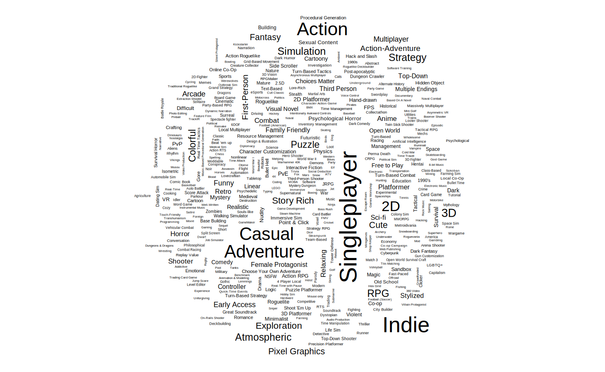
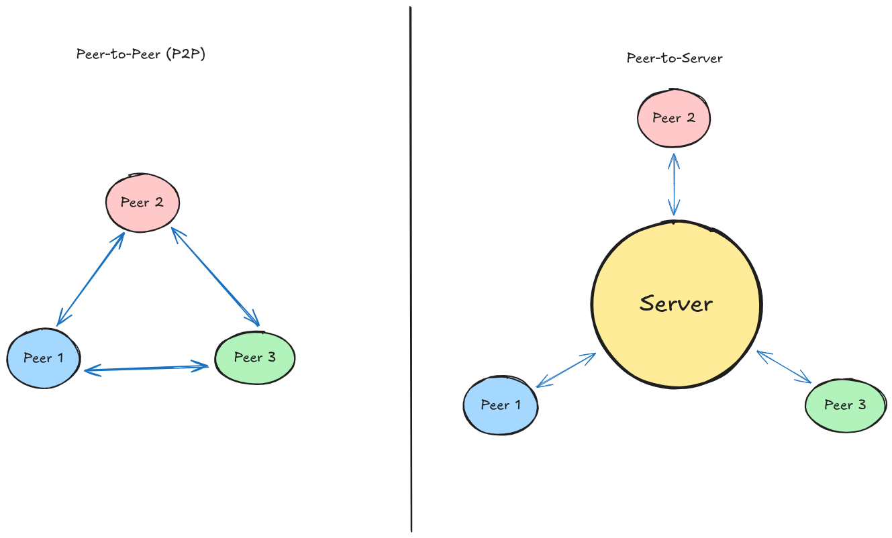

---

```{r include=FALSE}
source("./r_scripts/base.r")
```

> NOTE:
> Graphs may take up to a minute to load, any large blank spaces are likely an unloaded graph that is still processing.

## Intro

------------------------------------------------------------------------

  When it comes to putting your game out there, genre matters alot more than you'd think. Each genre resides in a corner of Steam, an ever expanding catalog of games by small indies and giants alike, and it's important to learn the culture and standards of that corner. Lately, multiplayer games have been on the rise with recent works like Lethal Company, Bopl Battle, Peak, and R.E.P.O. as examples. As I develop a prototype for my own commercial PvP (Player v.s. Player) game, it's becoming more important to understand the community behind it; to see gaps in the genre, find examples of games that have succeeded and failed in different earning brackets and why, and how they're priced.
  
  I'm using a database built by scraping \~140,000 released games off of Steam, collecting info like their tags, prices, review scores, and all other data Steam makes public. This data is from Q4 2024, approximately a year ago, so some data may have changed with the spike of the "friendslop" genre, a multiplayer-focused genre built around quick games you can jump into with a small group of friends, rather than bigger long-term journeys. I hypothesize that my game will fit into the space of games like Landfall's, makers of games like stick fight and ROUNDS, while having some sports and hot-potato elements present in party games like Mario Party, but more honed in to a specific idea.

## Tags

---

Tags are a big part of how Steam shares your game. It uses them to recommend your game alongside games with similar tags, as well as showing the game more to people who have played games with similar tags once you hit the Discovery Queue, a one-time opportunity every released game gets to be displayed to Steam users to test their viability. Because of this, it's important to hit the right tags, and they're really useful to analyze how different kinds of games, aswell as specific features in games, tend to perform. Among the games on the database, these are the tags used, scaled by how common they are:


We can infer some genres which may be over saturated like Casual, Adventure, and Action, but it'd be hard to say without data on review counts and whether or not indies are regularly finding break-throughs in the genre. The giant and clear outlier is single-player, even though not all single player games necessarily have the tag selected, you can see the stark difference between it and multiplayer at the top right corner. This is likely because online networking is a complicated process that most indies can't break into, but a benefit of the recent focus on party games and co-op is that you don't need any servers to connect different players with; these kinds of games are small enough that players can directly connect to each other in a system called Peer to Peer (P2P) instead of Peer to Server, and steam's servers for lobbies can complete the rest for joining a public lobby. This is more accessible than it used to be, and at no extra cost for anyone putting their game on Steam.



## Multiplayer Versus Single-player

---


We've also seen a rise in smaller, at times more janky games, such as Lethal Company which leans into it to add onto the fun of collecting scrap with friends, but that doesn't mean you can get away with a bad product, and the market tends to be harsher for multiplayer games which we can see by comparing the review scores of single player versus multiplayer games.
```{r echo=FALSE, results='asis', fig.width=4, fig.height=4, warning=FALSE}
shinyApp(
  ui = page(
    plotlyOutput(outputId = "sp_mp_reviews")
  ),
  server = function(input, output, session) {
    output$sp_mp_reviews <- renderPlotly({
      source("./r_scripts/review_count_sp_v_mp/a.r")
      print(fig)
    })
  }
)
```

The proportions of multiplayer games between Mostly Positive and Positive is much lower compared to single-player, with Very Positive and especially Mixed being much higher. This shows that people are stricter with multiplayer games, but when they're done right, they have potential for much higher outcomes because of how the social interactions complement a well designed multiplayer game.

Notably, very few games are below 'Mixed' as well. it'd preferably to always be above mixed, as it's hard to get out of once you are there, and we can see that 68.3% of multiplayer games are above mixed, compared to 76.3% of single-player games, showing that single-player games do better on average.

## Indie Viability

---

To test an indie developer's viability within the multiplayer space, we should see how many multiplayer games in each review category are under the 'Indie' tag. Again, this isn't perfect because not every indie developer is gonna select the tag. It's important to note that a chunk of 'Mixed' and below is going to be people's first beginner projects, so I hypothesize the curve is naturally going to be right skewed, it more matters if there's still some market share above that.

```{r echo=FALSE, results='asis', fig.width=4, fig.height=4, warning=FALSE}
shinyApp(
  ui = page(
    plotlyOutput(outputId = "indie_proportions")
  ),
  server = function(input, output, session) {
    output$indie_proportions <- renderPlotly({
      source("./r_scripts/review_score_ratios/refactor.r")
      print(fig)
    })
  }
)
```

Surprisingly, indie developers take up more than half of the market share within the 'Positive' and 'Overwhelmingly Positive' categories, and are consistently above 40% in all positive categories, aswell as 'Mixed' and 'Mostly Negative'. All 4 'Very Negative' are indies, but this is likely because of the low sample size within the category to begin with. This shows high viability for indie developers within the multiplayer genre, and the previously mentioned recent trends likely make it even more viable than it was a year ago. It's important to keep in mind the distribution between these categories from [Multiplayer Versus Single-player], But it's a, comparably, safe bet for indies to try to make a multiplayer game within Steam's market. With this knowledge, what should developers be making?

## Tags vs review count

---

```{r echo=FALSE, results='asis', fig.width=4, fig.height=4, warning=FALSE}
shinyApp(
  ui = page(
    plotlyOutput(outputId = "tags_reviews")
  ),
  server = function(input, output, session) {
    output$tags_reviews <- renderPlotly({
      source("./r_scripts/c/c.r")
      print(fig)
    })
  }
)
```

## Works Cited

------------------------------------------------------------------------

"Steam Catalog Insights (October 2024)". *NewbieIndieGameDev*. 10 Dec. 2024. <https://github.com/NewbieIndieGameDev/steam-insights>.

"Steam Tags". *Steamworks*. Valve Software. https://partner.steamgames.com/doc/store/tags

### Plugin citations

R Core Team (2025). _R: A Language and Environment for Statistical Computing_. R Foundation for Statistical Computing,
Vienna, Austria. <https://www.R-project.org/>.

C. Sievert. Interactive Web-Based Data Visualization with R, plotly, and shiny. Chapman and Hall/CRC Florida, 2020.

H. Wickham. ggplot2: Elegant Graphics for Data Analysis. Springer-Verlag New York, 2016.

Rupprecht F (2025). _httpgd: A 'HTTP' Server Graphics Device_. R
package version 2.0.4, commit
dd6ed3a687a2d7327bb28ca46725a0a203eb2a19,
<https://github.com/nx10/httpgd>.

Ooms J, James D, DebRoy S, Wickham H, Horner J (2025). _RMySQL:
Database Interface and 'MySQL' Driver for R_.
doi:10.32614/CRAN.package.RMySQL
<https://doi.org/10.32614/CRAN.package.RMySQL>, R package version
0.11.1, <https://CRAN.R-project.org/package=RMySQL>.

Müller K, Wickham H, James DA, Falcon S (2025). _RSQLite: SQLite
Interface for R_. doi:10.32614/CRAN.package.RSQLite
<https://doi.org/10.32614/CRAN.package.RSQLite>, R package version
2.4.5, <https://CRAN.R-project.org/package=RSQLite>.

Chang W, Cheng J, Allaire J, Sievert C, Schloerke B, Aden-Buie G, Xie
Y, Allen J, McPherson J, Dipert A, Borges B (2025). _shiny: Web
Application Framework for R_. doi:10.32614/CRAN.package.shiny
<https://doi.org/10.32614/CRAN.package.shiny>, R package version
1.12.0, <https://CRAN.R-project.org/package=shiny>.

Sievert C, Cheng J, Aden-Buie G (2025). _bslib: Custom 'Bootstrap'
'Sass' Themes for 'shiny' and 'rmarkdown'_.
doi:10.32614/CRAN.package.bslib
<https://doi.org/10.32614/CRAN.package.bslib>, R package version
0.9.0, <https://CRAN.R-project.org/package=bslib>.

Tennekes M (2023). _treemap: Treemap Visualization_.
doi:10.32614/CRAN.package.treemap
<https://doi.org/10.32614/CRAN.package.treemap>, R package version
2.4-4, <https://CRAN.R-project.org/package=treemap>.

Fellows I (2018). _wordcloud: Word Clouds_.
doi:10.32614/CRAN.package.wordcloud
<https://doi.org/10.32614/CRAN.package.wordcloud>, R package version
2.6, <https://CRAN.R-project.org/package=wordcloud>.

Xie Y, Cheng J, Tan X, Aden-Buie G (2025). _DT: A Wrapper of the
JavaScript Library 'DataTables'_. doi:10.32614/CRAN.package.DT
<https://doi.org/10.32614/CRAN.package.DT>, R package version 0.34.0,
<https://CRAN.R-project.org/package=DT>.

Cheng J, Sievert C, Schloerke B, Chang W, Xie Y, Allen J (2025).
_htmltools: Tools for HTML_. doi:10.32614/CRAN.package.htmltools
<https://doi.org/10.32614/CRAN.package.htmltools>, R package version
0.5.9, <https://CRAN.R-project.org/package=htmltools>.

Allaire J, Xie Y, Dervieux C, McPherson J, Luraschi J, Ushey K, Atkins A, Wickham H, Cheng J, Chang W, Iannone R
(2025). _rmarkdown: Dynamic Documents for R_. R package version 2.30, <https://github.com/rstudio/rmarkdown>.

Xie Y, Allaire J, Grolemund G (2018). _R Markdown: The Definitive Guide_. Chapman and Hall/CRC, Boca Raton, Florida.
ISBN 9781138359338, <https://bookdown.org/yihui/rmarkdown>.

Xie Y, Dervieux C, Riederer E (2020). _R Markdown Cookbook_. Chapman and Hall/CRC, Boca Raton, Florida. ISBN
9780367563837, <https://bookdown.org/yihui/rmarkdown-cookbook>.